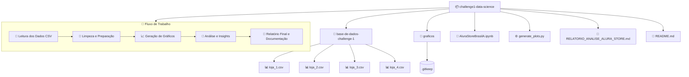
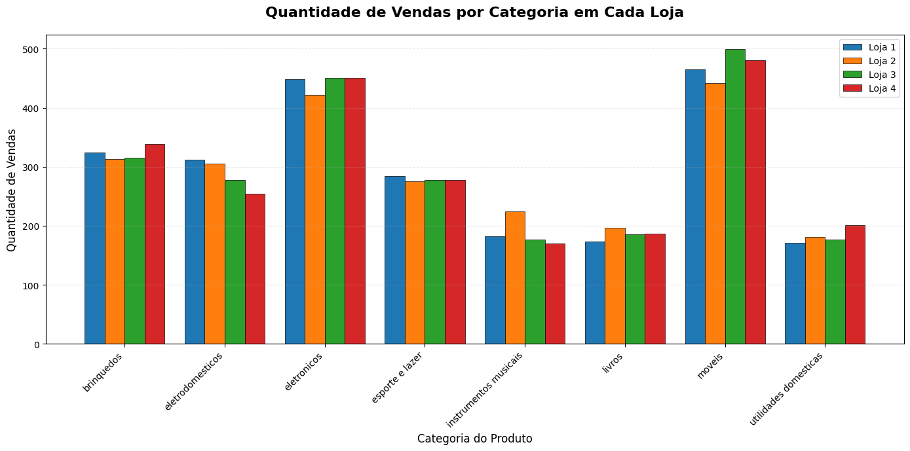
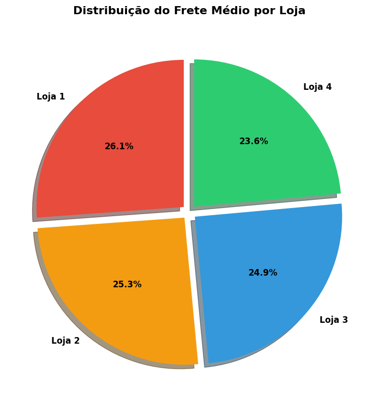
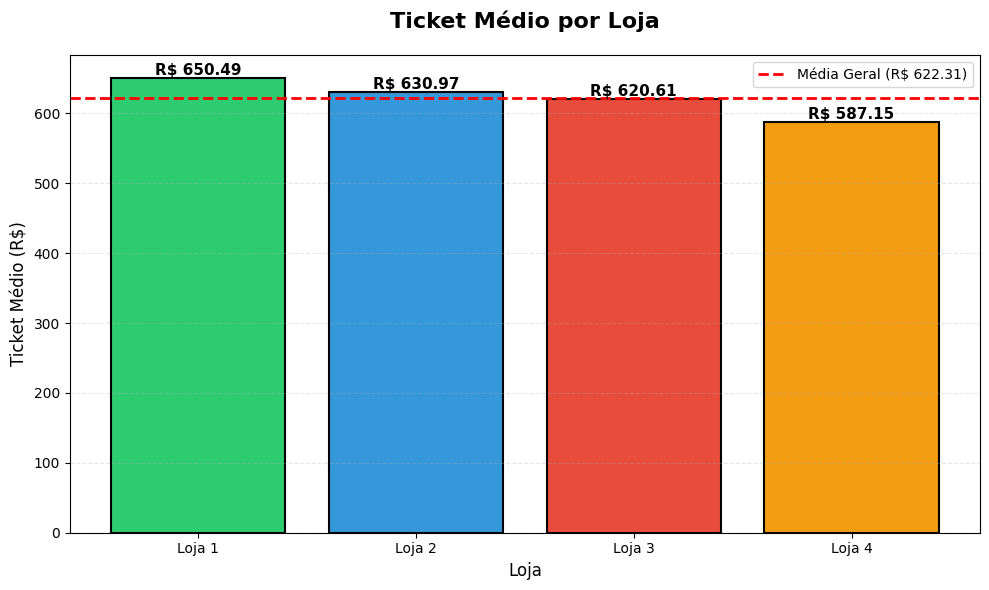

# 🏬 Alura Store Brasil – Análise de Vendas

## 📖 Sobre o Projeto  
O projeto **Alura Store Brasil** faz parte do **Challenge Data Science da Alura**, com o objetivo de realizar uma **análise exploratória e visual de dados de vendas** de diferentes lojas, utilizando ferramentas do ecossistema **Python**.

O desafio consiste em:
- Consolidar dados de quatro lojas diferentes;
- Tratar e limpar os dados com **Pandas**;
- Gerar gráficos interativos e relatórios no **Jupyter Notebook**;
- Extrair **insights sobre desempenho, categorias e regiões de vendas**.

---

## 🧭 Estrutura do Projeto (Mermaid)



---

## 💻 Tecnologias Utilizadas  

| Tecnologia | Função Principal |
|-------------|------------------|
| 🐍 **Python 3.x** | Linguagem principal da análise |
| 🧮 **Pandas** | Tratamento e consolidação dos dados |
| 📊 **Matplotlib / Seaborn** | Geração de gráficos e visualizações |
| 📓 **Jupyter Notebook** | Ambiente interativo de documentação e execução |
| 🗃️ **Git & GitHub** | Controle de versão e publicação do projeto |

---

## 🧠 Resultados Obtidos  

O relatório apresenta uma visão detalhada sobre:
- 💹 O **volume total de vendas** por loja e categoria  
- ⭐ A **média de avaliações por vendedor**  
- 🗺️ A **distribuição geográfica das vendas no Brasil**  
- 📆 A **evolução temporal das vendas**, facilitando a identificação de tendências  

Os gráficos permitem compreender o comportamento do consumidor e o desempenho das lojas de forma clara e visual.










## 📂 Estrutura de Diretórios

```
challenge1-data-science/
│
├── base-de-dados-challenge-1/
│   ├── loja_1.csv
│   ├── loja_2.csv
│   ├── loja_3.csv
│   └── loja_4.csv
│
├── graficos/
│   └── .gitkeep
│
├── AluraStoreBrasilA.ipynb
├── generate_plots.py
├── RELATORIO_ANALISE_ALURA_STORE.md
└── README.md
```

---

## 🧾 Autor  

**Alisson Luiz Siqueira Coqueiro**  
📧 [alissonls@gmail.com](mailto:alissonls@gmail.com)  
💼 [LinkedIn](https://www.linkedin.com/in/alissoncoqueiro/)  

---

### 🪪 Licença  
© 2025 **Alisson Luiz Siqueira Coqueiro** – Todos os direitos reservados.  
Projeto desenvolvido para fins educacionais no **Challenge Data Science – Alura**.
