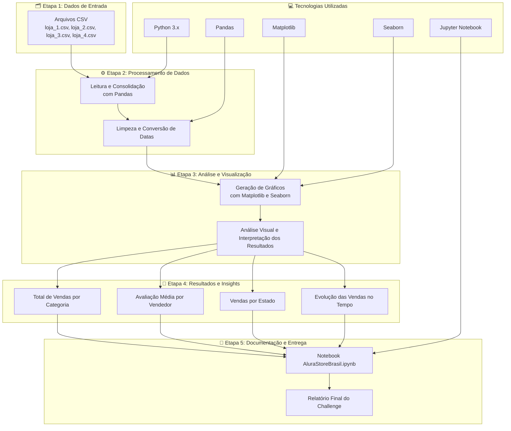

# 🏬 Alura Store Brasil – Análise de Vendas

## 📖 Sobre o Projeto
O projeto **Alura Store Brasil** faz parte do **Challenge Data Science da Alura**, com o objetivo de desenvolver uma análise completa de dados de vendas utilizando ferramentas do ecossistema Python.  

O desafio envolve a consolidação de dados de **quatro lojas diferentes** e a criação de um relatório visual e interativo com gráficos e insights sobre desempenho comercial, categorias mais vendidas e comportamento de compra por região.

---

## 🧭 Fluxo do Projeto (Mermaid)



---

## 💻 Tecnologias Utilizadas

| Tecnologia | Descrição |
|-------------|------------|
| 🐍 **Python 3.x** | Linguagem principal para análise de dados. |
| 📦 **Pandas** | Manipulação, limpeza e análise de dados. |
| 📈 **Matplotlib** | Criação de gráficos e visualizações. |
| 🎨 **Seaborn** | Estilização e aprimoramento visual dos gráficos. |
| 📘 **Jupyter Notebook** | Ambiente interativo para execução e documentação. |

---

## 🧠 Resultados

O relatório final apresenta uma visão clara sobre:

- O volume total de vendas por loja e categoria  
- A média de avaliações por vendedor  
- A distribuição geográfica das vendas no Brasil  
- A evolução temporal das vendas, permitindo detectar tendências  

---

## 🧩 Estrutura do Projeto

```
📦 Alura_Store_Brasil
 ┣ 📜 README.md
 ┣ 📓 AluraStoreBrasil.ipynb
 ┣ 📁 data/
 ┃ ┣ loja_1.csv
 ┃ ┣ loja_2.csv
 ┃ ┣ loja_3.csv
 ┃ ┗ loja_4.csv
 ┣ 📁 img/
 ┃ ┣ vendas_por_categoria.png
 ┃ ┣ avaliacao_vendedor.png
 ┃ ┣ vendas_por_estado.png
 ┃ ┗ evolucao_vendas.png
 ┗ 📁 .venv/
```

---

## © Direitos Autorais

**© 2025 - Alisson Luiz Siqueira Coqueiro**  
Projeto desenvolvido como parte do **Challenge Data Science da Alura**.  
Todos os direitos reservados.
